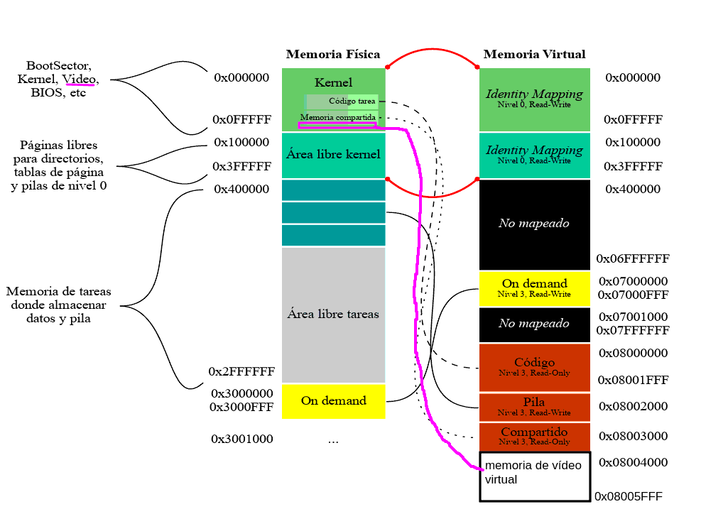
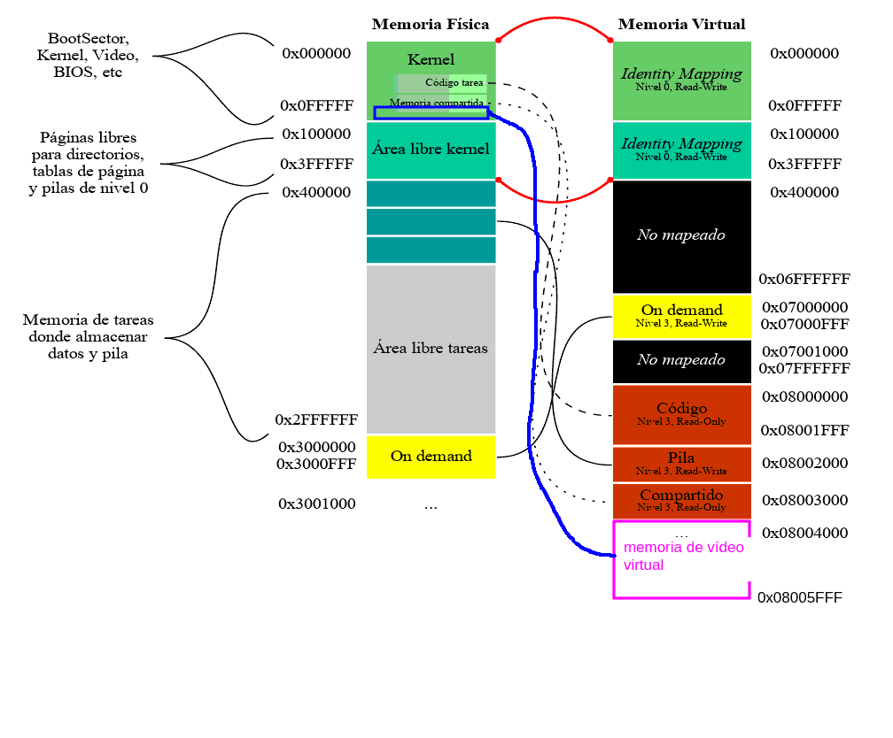

## a. Dibuje el esquema de memoria virtual de las tareas del nuevo sistema.
Esquema de memoria de la tarea "actualmente en pantalla":


Aclaracion relevante: 
El segmento de vídeo (pantalla) arranca en 0xB8000 y termina en 0xB9FFF

Esquema de memoria de las tareas que escriben en la pantalla "dummy":

La región física donde mapea para este caso es la 0x1E000-0x1FFFF

## b. Describa los cambios al proceso de creación de tareas (init_task_dir, create_task, sched_add_task, etc. . . ). Muestre código y pseudocódigo
init_task_dir:
Tiene que contemplar que va a haber dos nuevas páginas con dirección virtual 
la primera 0x08004000
la segunda 0x08005000
que pueden estar mapeadas a 0x1E000 y 0x1F000 o a 0xB8000 y 0xB9000 dependiendo de si se quiere que la tarea escriba a la pantalla dummy o la pantalla real.

Idea: Hago que init_task_dir, create_task, y mmu_init_task_dir mapeen por defecto a la dummy. Luego tengo en el scheduler una variable global que me indica el indice de la tarea que actualmente esta en pantalla (la inicializo en 0), cuando el usuario suelta tab le agrego uno a esa variable (le puedo aplicar módulo de la cantidad de tareas para que nunca se me vaya del rango de tareas existentes) y remapeo las direcciones virtuales de la nueva tarea actualmente en pantalla para que se correspondan con las de la pantalla real.

reciclando parte del código del tp:
```
paddr_t mmu_init_task_dir(paddr_t phy_start) {
	pd_entry_t* directorio_de_páginas_tarea = (pd_entry_t*)mmu_next_free_kernel_page();  //todos los directorios y tablas tienen que ser solo accesibles para el kernel (creo)
	
	zero_page((paddr_t)directorio_de_páginas_tarea); // limpio la basura que había en esa página
	
	directorio_de_páginas_tarea[0].pt = (uint32_t)KERNEL_PAGE_TABLE_0 >> 12; //identity mapping de las páginas del kernel, alcanza con una única tabla de páginas
	
	directorio_de_páginas_tarea[0].attrs = 0x3; //PRESENT Y WRITABLE, pero con el bit U/S puesto en 0 entonces la tarea no puede accederlo
	
	mmu_map_page((uint32_t)directorio_de_páginas_tarea, TASK_STACK_BASE-PAGE_SIZE, mmu_next_free_user_page(), 0x7); //defino la pila de nivel 3, 0x7 es 111 en binario, osea que con esto estoy diciendo Present, Writable y User (ver diapo 44 del pdf de paginación) 
	
	mmu_map_page((uint32_t)directorio_de_páginas_tarea, TASK_CODE_VIRTUAL, phy_start, 0x5); // 0x5 es 0b101, osea que esta presente y es de usuario
	
	mmu_map_page((uint32_t)directorio_de_páginas_tarea, TASK_CODE_VIRTUAL + PAGE_SIZE, phy_start + PAGE_SIZE, 5); //porque la descripción dice que hay dos páginas de código para la tarea
	
	mmu_map_page((uint32_t)directorio_de_páginas_tarea, TASK_SHARED_PAGE, 0x1D000, 0x5); // 0x5 es Present, read only, User (0b101)
	mmu_map_page((uint32_t)directorio_de_páginas_tarea, 0x08004000, 0x1E000, 0x7); //mapeo a la pantalla dummy 
	mmu_map_page((uint32_t)directorio_de_páginas_tarea, 0x08005000, 0x1F000, 0x7); 

	return (paddr_t)directorio_de_páginas_tarea;
}
```
create_task, sched_add_task y sched_next_task las dejo como estaban en el tp
Creo una variable global en sched.c que sea:
int8_t actualmente_en_pantalla = 0;

## c. Explique qué mecanismo usará para que el sistema sepa “a qué tarea le toca” el acceso a la pantalla.

Va a tener una variable global que le indica ello, la que mencione en el punto b.

## d. Describa los cambios necesarios para realizar el “cambio de pantalla” al soltar la tecla TAB. Proponga una implementación posible mostrando código y pseudocódigo
Hago que init_task_dir, create_task, y mmu_init_task_dir mapeen por defecto a la dummy. Luego tengo en el scheduler una variable global que me indica el indice de la tarea que actualmente esta en pantalla (la inicializo en 0), cuando el usuario suelta tab le agrego uno a esa variable (le puedo aplicar módulo de la cantidad de tareas para que nunca se me vaya del rango de tareas existentes) y remapeo las direcciones virtuales de la nueva tarea actualmente en pantalla para que se correspondan con las de la pantalla real y mapeo la dirección virtual de la tarea que esta dejando de ser la "actualmente en pantalla" para que apunte a la dummy.

Para lograr esto que estoy mencionando tengo que modificar la isr33, que es la rutina de atención del teclado. También podría tener una nueva función en sched.c que sea "cambiar_tarea_actualmente_en_pantalla", la cual voy a llamar desde la isr del teclado.
En código la isr33 quedaría:
_isr33:
    pushad

    ; 1. Le decimos al PIC que vamos a atender la interrupción
    call pic_finish1
    ; 2. Leemos la tecla desde el teclado y la procesamos
    in al, 0x60
    
    push eax
    call tasks_input_process
    
    ;si el scancode es justo 0x0f+0x80=0x8f (el 0x0f por la tabulación en sí + el bit que indica que se solto la tecla) entonces llamo a cambiar_tarea_actualmente_en_pantalla
    pop eax
    cmp al, 0x8f 
    jne .fin
    call cambiar_tarea_actualmente_en_pantalla
    
    .fin:
    popad
    iret

void cambiar_tarea_actualmente_en_pantalla() {
	// hago que la actualmente en pantalla empiece a apuntar a la pantalla dummy
	//void mmu_map_page(uint32_t cr3, vaddr_t virt, paddr_t phy, uint32_t attrs)
	mmu_map_page(obtenerTSS(sched_tasks[actualmente_en_pantalla])->cr3,0x08004000,0x1E000, 7) // 7 = 0b111 osea user, writable y present 
	mmu_map_page(obtenerTSS(sched_tasks[actualmente_en_pantalla])->cr3,0x08005000,0x1F000, 7)
	
	//hago que la nueva actualmente_en_pantalla empiece a escribir en la pantalla real:
	actualmente_en_pantalla = (actualmente_en_pantalla+1)%MAX_TASKS;
	mmu_map_page(obtenerTSS(sched_tasks[actualmente_en_pantalla])->cr3,0x08004000,0xB8000, 7) // 7 = 0b111 osea user, writable y present 
	mmu_map_page(obtenerTSS(sched_tasks[actualmente_en_pantalla])->cr3,0x08005000,0xB9000, 7) 
}

la función obtenerTSS es la siguiente:
ss_t* obtener_TSS(uint16_t segsel) {
	uint16_t idx = segsel >> 3;
	∕∕ (esto en realidad se guarda de a partes en la GDT entry)
	return gdt[idx].base;
}

## e. En el mecanismo propuesto las tareas no tienen forma sencilla de saber si “es su turno” de usar la pantalla. Proponga una solución. No se pide código ni pseudocódigo, sólo la idea.
Podría haber una función en el scheduler que se le pueda pasar como argumento el selector de la tarea y devuelva true si el indice de la tarea en cuestión dentro de sched_tasks se corresponde con el valor de "actualmente_en_pantalla". Y que la tarea pueda llamar indirectamente a esa función a través de una interrupción de software. 

## f. En el mecanismo propuesto la tarea debe redibujar toda su pantalla cuando logra conseguir acceso a la misma. ¿Cómo podría evitarse eso? No se pide código ni pseudocódigo, sólo la idea.
Sí, podría evitarse.
En vez de tener una sola pantalla dummy podrian tenerse varias (una por tarea), entonces cuando se cambie de tarea_actualmente_en_pantalla se guarda en la dummy de la tarea el contenido y cuando vuelve a tener control de la pantalla real se vuelca el contenido de la dummy en la pantalla real. 


## Ejercicio 2
Me suena que ya lo hicimos en clase así que no lo voy a hacer de vuelta. 
